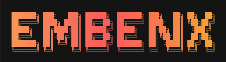

<!-- generated-by: gsd-doc-writer -->
<div align="center">



<h1>Embenx — Agentic Memory Layer for Python AI Agents 🚀</h1>

<p>
  <strong>The Agentic Memory Layer & Universal Retrieval Toolkit.</strong><br/>
  Synthetic data generation, 20+ vector backends, hybrid search, and MCP native memory for AI agents.
</p>

<p>
  <a href="https://github.com/adityak74/embenx/stargazers"></a>
  <a href="https://github.com/adityak74/embenx/issues"></a>
  <a href="https://opensource.org/licenses/MIT"></a>
  <a href="https://www.python.org/downloads/"></a>
  <a href="https://adityak74.github.io/embenx/"></a>
  <a href="https://github.com/astral-sh/uv"></a>
</p>

<p>
  <a href="https://pypi.org/project/embenx/"></a>
  <a href="https://pypi.org/project/embenx/"></a>
</p>

<p>
  <strong><a href="https://adityak74.github.io/embenx/">📖 Read the Docs</a></strong> &nbsp;·&nbsp;
  <a href="https://adityak74.github.io/embenx/">Explore the Visual UI</a> &nbsp;·&nbsp;
  <a href="https://github.com/adityak74/embenx/issues">Report Bug</a> &nbsp;·&nbsp;
  <a href="https://github.com/adityak74/embenx/issues">Request Feature</a>
</p>

</div>

---

## What is Embenx?

Embenx is a Python-native retrieval library that sits between raw vector indices and full-blown vector databases. It provides a high-level `Collection` API for managing embeddings and metadata, supporting advanced features like **filtering**, **reranking**, and **quantization** across 20+ backends.

### 🌟 New in v1.5.1: OpenSearch Integration
Embenx now natively supports **OpenSearch** as a vector backend. Scale your agentic memory to production clusters with native k-NN vector search and enterprise-grade durability.

---

## Quickstart

Get up and running in 60 seconds.

**Step 1 — Install**
```bash
pip install embenx
```

**Step 2 — Create a collection and add embeddings**
```python
import numpy as np
from embenx import Collection

# 768-dim FAISS-HNSW index (in-memory, no extra config needed)
col = Collection(dimension=768, indexer_type="faiss-hnsw")

vectors = np.random.rand(10, 768).astype("float32")
metadata = [{"id": i, "text": f"Document {i}"} for i in range(10)]
col.add(vectors, metadata)
```

**Step 3 — Search**
```python
query = np.random.rand(768).astype("float32")
results = col.search(query, top_k=3)

for meta, dist in results:
    print(f"{meta['text']}  (distance: {dist:.4f})")
```

---

## Library Usage

### 🚀 Production Deployment (OpenSearch, Qdrant, Milvus)
Embenx makes it easy to transition from local development to production-grade vector clusters.

```python
from embenx import Collection

# Initialize with OpenSearch (Assumes http://localhost:9200)
# Use OPENSEARCH_URL env var to override
col = Collection(dimension=128, indexer_type="opensearch")

# Add data directly to OpenSearch
col.add(vectors, metadata)

# Search with native k-NN
results = col.search(query_vector, top_k=5)
```

### 🧠 Agentic Memory & Hybrid Search
Combine semantic search with keyword retrieval and self-healing feedback loops.

```python
from embenx import Collection

# Initialize with hybrid search (FAISS + BM25)
col = Collection(dimension=768, indexer_type="faiss-hnsw", sparse_indexer_type="bm25")

# Hybrid Search using RRF (Reciprocal Rank Fusion)
results = col.hybrid_search(
    query_vector=query_vec,
    query_text="What is the capital of France?",
    top_k=5
)

# Self-healing feedback
col.feedback(doc_id="doc_123", label="good")
```

### 🧪 Synthetic Data Generation
Generate high-quality query-document pairs to train or evaluate your retrieval pipelines.

```python
results = col.generate_synthetic_queries(
    n_queries_per_doc=2,
    num_docs=100,
    model="gpt-4o-mini",  # Or "ollama/llama3"
    output_path="eval_data.jsonl"
)
```

---

## Agentic Memory (MCP)

Embenx ships with a built-in **Model Context Protocol (MCP)** server. This allows AI agents (like Claude Desktop) to use Embenx collections as their own long-term memory.

### 1. Start the server
```bash
embenx mcp-start
```

---

## Visual Explorer

Embenx provides a built-in web UI to visualize your vector collections, including an interactive **HNSW Graph Visualizer** and a **RAG Playground**.

```bash
embenx explorer
```

---

## Features

- **20+ Vector Backends** — Native support for OpenSearch, Qdrant, Milvus, FAISS, PGVector, and more.
- **Synthetic Data Generation** — Create high-quality query-document pairs using LLMs for training and evaluation.
- **Multimodal Support** — Native support for image embeddings (CLIP).
- **RAG Playground** — Test retrieval quality with an integrated LLM chat loop.
- **HNSW Graph Visualizer** — Interactive 3D visualization of navigation layers.
- **Agentic Memory (MCP)** — Native Model Context Protocol support for AI agents.
- **Self-Healing Retrieval** — Integrated feedback loops to automatically improve ranking accuracy.
- **Temporal Memory (Echo)** — Recency-biased retrieval and time-window filtering.
- **Spatial Memory (ESWM)** — Neuroscience-inspired spatial cognitive maps for navigation.
- **Hybrid Search** — Combine dense vectors with sparse BM25 retrieval using RRF.
- **Portable Formats** — Native support for Parquet, NumPy (.npy/.npz), and FAISS (.index).

---

## Supported Indexers

| Indexer Key | Family / Algorithm | Best For |
| :--- | :--- | :--- |
| `opensearch` | OpenSearch | **Native k-NN vector search (Production)** |
| `faiss-hnsw` | FAISS HNSW | High-recall in-memory search |
| `qdrant` | Qdrant | Filtered vector search at scale |
| `milvus` | Milvus Cluster | Distributed production workloads |
| `pgvector` | PostgreSQL pgvector | Embeddings next to relational data |
| `elasticsearch` | Elasticsearch | Full-text + vector search combined |
| `scann` | ScaNN Tree-AH | State-of-the-art speed/recall (Linux) |
| `usearch` | USearch HNSW | High-performance C++, low latency |
| `hnswlib` | HNSWLib | Pure HNSW, easy to tune |
| `weaviate` | Weaviate | Multi-tenant, schema-driven search |
| `duckdb` | DuckDB | Analytical + vector hybrid queries |
| `lance` | LanceDB Columnar | Large disk-based datasets |
| `bm25` | BM25 (sparse) | Keyword / sparse retrieval baseline |
| `simple` | NumPy Exact | Exact search, zero dependencies |

*...and 8 more variants including quantized (PQ/SQ8) and half-precision (f16/i8) indices.*

---

## Installation

```bash
pip install embenx
```

## License

Distributed under the **MIT License**. See `LICENSE` for more information.

---

<div align="center">
  Built with ❤️ for the AI engineering community by <a href="https://github.com/adityak74">adityak74</a>
</div>
